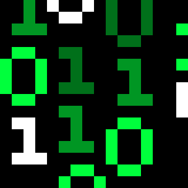

## <i>"Untitled Website"</i>
An "updative" unblocked games archive for people with very restrictive internet access.

## Github.io domain Blocked?
If your administrator blocks the 'github.io' domain for "Security - Domain Sharing" or anything else, then go to the <a href="https://github.com/sdstatt/untitled_website/blob/main/unblocked/repo_list.md"> unblocked repo_list.MD file on the github repo<a>.

## Links
<a href="https://sdstatt.github.io/untitled_website/">Click here to view the website</a>

## Installation for .RAR files
1. Go to the repository webpage (if blocked, check the <a href="https://github.com/sdstatt/untitled_website/blob/main/unblocked/repo_list.md">unblocked repo_list.MD file on the github repo</a>).
2. Find the text that says, "To unzip .RAR files, click here to download the 7-ZipPortable.zip file."
3. Click the "click here" link to download the .ZIP file.
4. Unzip the 7-ZipPortable.zip file or open the 7-ZipPortable.zip file and drag the folder to your folder of choice.
5. Now that you've downloaded the 7-Zip program, download the games you like,
6. Download "the game that you've picked".RAR file by clicking the "click to download" link,
7. Right-click on "the game that you've picked".RAR file,
8. Hover over "Open with," > Click "Choose another app," > Scroll and click "More Apps," > and click "Look for another app on this PC,"
9. Go to the unzipped 7-ZipPortable folder and select 7-ZipPortable.exe inside the folder,
10. Click on the folder and click "Extract."
11. Set the folder download destination and click OK,
12. Your downloaded and unzipped game should be in the game folder you downloaded to. <code>C:/Users/[USERNAME]/[DOWNLOADS or WHEREVER YOU PUT IT]/[GAME FOLDER HERE]</code>
13. Enjoy your unblocked entertainment while it lasts!

## FAQ
- *Why is this project named "Untitled Website?"*

The reason why this project is named "Untitled Website" is that, well, why not? I mean, you don't have to make an original name for this lol. But seriously, it's so that teachers are less suspicious and assume this website isn't just for entertainment, even though it is.

- *Are you associated with Bradnails or any other unblocked game repository?*

No, but I was inspired by their work to make one of my own, and since they haven't updated in a while, I'm doing god's work by (re)adding content that was removed, hasn't been updated, or hasn't been added yet by them.

- *Where and how do I install the game(s)?*

You can find them inside the repository on <a href="https://sdstatt.github.io/untitled_website/">the website</a> or the <a href="https://github.com/sdstatt/untitled_website/blob/main/unblocked/repo_list.md">unblocked repo_list.MD file on this github repo</a> and click the links to download them from there. For a full guide on unzipping the <code>.RAR</code> or <code>.7z</code> files so that you can actually play them, refer to the "[Installation for .RAR files](#installation-for-rar-files)" section of this README.md file.

- *How do I uninstall my games?*

Delete the game folder wherever you have it, delete the associated game data folder in your Documents folder (if not, check where it is stored, probably in %appdata%), and clear your Recycle Bin.

- *How can I not get caught?*

Here are the 3 ways to not get caught while playing games:
1. *Creating a Separate Desktop:*  <code>Alt+Win</code>, create a separate desktop and drag your game window into it. This makes it so that on your regular desktop you don't have the game window open, but on a separate desktop you do.
2. *Minimizing your Game Window:* On your window, the first button to the right that looks like a bar is the Minimize button. It will hide the window until you unminimize it from the taskbar or <code>Alt+Tab</code> back into it.
3. *Switching tabs:* Press <code>Alt+Tab</code> to quickly switch tabs.

If you follow these, I can assure you that you will be safe. Make sure that when a teacher isn't nearby, you can be safer and sneakier.
